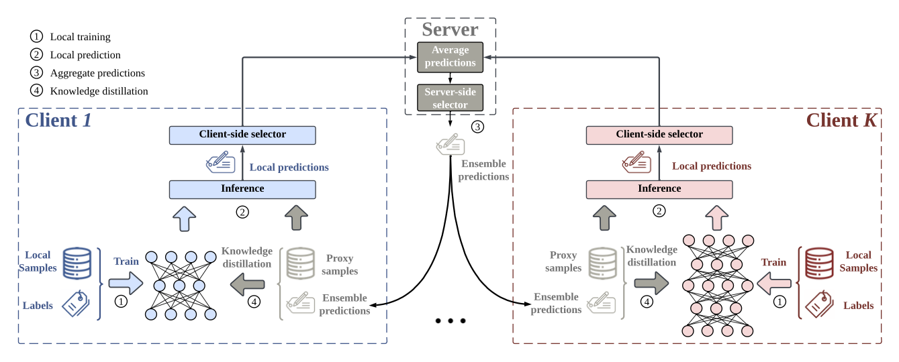

# Selective-FD

The official PyTorch implementation of the Selective-FD method proposed in the manuscript ["Selective Knowledge Sharing for Privacy-Preserving Federated Distillation without A Good Teacher"](https://arxiv.org/abs/2304.01731)


## Introduction

While federated learning is promising for privacy-preserving collaborative learning without revealing local data, it remains vulnerable to white-box attacks and struggles to adapt to heterogeneous clients. Federated distillation (FD), built upon knowledge distillation--an effective technique for transferring knowledge from a teacher model to student models--emerges as an alternative paradigm, which provides enhanced privacy guarantees and addresses model heterogeneity. Nevertheless, challenges arise due to variations in local data distributions and the absence of a well-trained teacher model, which leads to misleading and ambiguous knowledge sharing that significantly degrades model performance. To address these issues, this paper proposes a selective knowledge sharing mechanism for FD, termed Selective-FD. It includes client-side selectors and a server-side selector to accurately and precisely identify knowledge from local and ensemble predictions, respectively. 

## Overall framework of Selective-FD



Each client owns a private local dataset and a personalized model.  To transfer knowledge in each communication round, the clients upload the local predictions of proxy samples to the server for aggregation, and the ensemble predictions are sent back to clients for knowledge distillation. The client-side selectors and the server-side selector are responsible for filtering out misleading and ambiguous knowledge from the clients' predictions.


### (2023-Apr-06) We provide a demo to evaluate Selective-FD on the MNIST dataset.


#### Setup

- Dataset: `MNIST`
- Non-IID scenario: There are 10 clients in the federated system, where each client only has one unique class.
- The dataset `./data/MNISTTrainDataset.pth` contains the local datasets and the proxy dataset, where each local dataset contains around 5,400 samples, and the proxy dataset has around 6,000 samples.
- The soft labels (i.e., normalized logits) are shared during federated distillation. 

#### How to Run 

- Unzip `MNISTTrainDataset.pth.zip` to `MNISTTrainDataset.pth`
- Run our proposed Selective-FD method by `python Selective-FD.py`, and run the baselien [FedMD](https://arxiv.org/abs/1910.03581) method by `Python baseline_FedMD.py`.


#### Others


- The initial run of `python Selective-FD.py` could be time-consuming as it needs to construct a dataset `./data/MNISTSelectedProxyDataset.pth`.
- Please note that our method has the ability to support heterogeneous local models. But, for the sake of simplicity, we assume that all the clients adopt the same local models in this demo.


## Citation
```
@misc{shao2023selective,
      title={Selective Knowledge Sharing for Privacy-Preserving Federated Distillation without A Good Teacher}, 
      author={Jiawei Shao and Fangzhao Wu and Jun Zhang},
      year={2023},
      eprint={2304.01731},
      archivePrefix={arXiv},
      primaryClass={cs.LG}
}
```